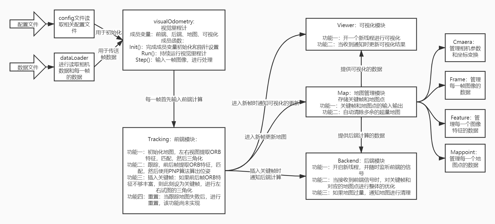
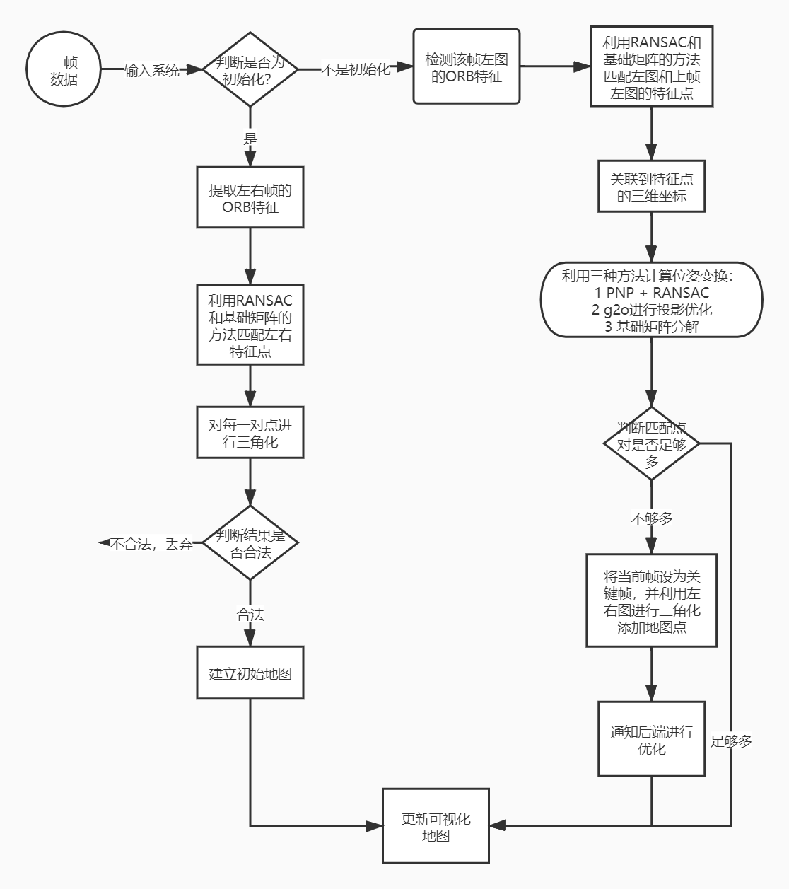

## primerStereoSlam简介

这是一个带领初学者入门的slam系统，适合刚刚学完高翔的《视觉SLAM十四讲》的读者，在该项目中，我们实现了一个“麻雀虽小，五脏俱全”的slam系统，其包含以下部分：

- **前端**：视觉里程计，使用ORB特征点法，支持三种求解位姿的方法：g2o投影优化法、PNP + RANSAC法、对极几何分解基础矩阵法
- **后端**：使用g2o进行投影，优化选择的七个关键帧
- **可视化**：使用pangolin进行实时可视化

总体而言，该系统实现了双目slam，并在kitti数据集上进行了测试，代码可读性高，原理覆盖全面，是《视觉slam十四讲》中各种原理的综合性运用，欢迎slam领域初学者学习交流～


### demo演示


### 开发说明

**开发者**

- [**AlanJiang98**](https://github.com/AlanJiang98)，清华电子本，北大智能硕，研一在读
- [**braveryCHR**](https://github.com/braveryCHR)，北京大学智能系本硕，研一在读

**开发技术**：全程使用clion编写C++，使用cmakelist组织工程

**工程量**：约两千行代码

**开发用时**：20天*人

**人员分工：**

- [**braveryCHR**](https://github.com/braveryCHR)
  - 负责一部分辅助类的编写
  - 负责前端的编写
  - 负责一部分的debug工作
  - 负责github文档的撰写
- [**AlanJiang98**](https://github.com/AlanJiang98)
  - 负责一部分辅助类的编写
  - 负责后端的编写
  - 负责一部分的debug工作
  - 负责项目报告的撰写


### 基础知识

- 多视图几何，例如三维重建和slam的基础知识
- C++工程能力，如cmakelist和工程编译调试能力
- 一定的计算机视觉基础


### 安装和运行

提前安装以下C++基础库，其中opencv建议3.4.5

```cmake
# Eigen3
find_package(Eigen3)
INCLUDE_DIRECTORIES(${EIGEN3_INCLUDE_DIR})
    
# OPENCV
find_package(OpenCV REQUIRED)
include_directories(${OpenCV_INCLUDE_DIRS})
    
# Sophus
find_package(Sophus REQUIRED)
include_directories(${Sophus_INCLUDE_DIRS})
    
# pangolin
find_package(Pangolin REQUIRED)
include_directories(${Pangolin_INCLUDE_DIRS})

# G2O
find_package(G2O REQUIRED)
include_directories(${G2O_INCLUDE_DIRS})

# glog
find_package(Glog REQUIRED)
include_directories(${GLOG_INCLUDE_DIRS})

# csparse
find_package(CSparse REQUIRED)
include_directories(${CSPARSE_INCLUDE_DIR})
```

之后：

```bash
git clone https://github.com/braveryCHR/primerStereoSlam.git --depth 1
cd primerStereoSlam
mkdir build
cd build
cmake ..
make -j12
```

即安装成功

接着下载kitti数据集，可以在这里使用百度云下载

链接：https://pan.baidu.com/s/1-4WchJlcZ2guwcfbHqrdFw
提取码：grys

数据集可以放在primerStereoSlam/data文件夹下

然后修改config/default.yaml文件，将dataset_dir: /home/bravery/CLionProjects/primerStereoSlam/data/00改成你自己的数据集路径，然后

```bash
./bin/sterenSlamRun
```

即可运行


### 系统架构

首先是系统架构，如下图所示 



其次是数据流处理逻辑，如下图所示




### 总结

研一上学期即将结束，我也选择了三维视觉作为自己未来研究的方向，希望和各位一起再接再厉，能在这一道路上走的更远！